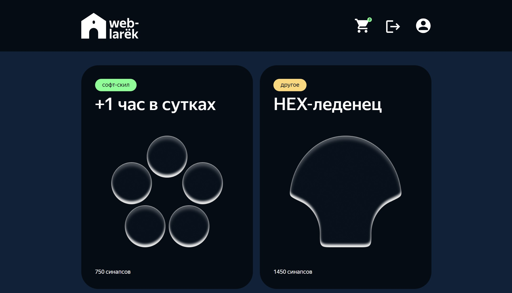

# "WebLarek"

Проект магазина товаров.

## Описание

Простой проект для демонстрации витрины с регистрацией, выбором товаров и оформлением покупки.

### 🚀 Возможности:

- Зарегистрироваться и авторизоваться.
- Просмотреть список товаров.
- Выбирать товар и заполнять необходимые данные (имя, адрес).
- Возможность добавления нескольких шаблонов.
- Оформлять заказ
- Профиль пользователя с просмотрем заказов.
- Профиль администратора с просмотрем всех заказов.

## Подготовка к запуску
1. Склонировать репозиторий
2. Наполнить базу данных Moongo
    2.1. Выбираем коллекцию users, в ней ADD DATA и Import JSON or CSV file. Выбираем файл .dump/weblarek.users.json
    2.2. Выбираем коллекцию products, в ней ADD DATA и Import JSON or CSV file. Выбираем файл .dump/weblarek.products.json Файлы изображений для продуктов уже находятся в директории backend/src/public/images/
3. Запускаем npm run dev в папке frontend и в папке backend
4. Перейти по адресу http://localhost/ и на странице должны быть продукты.
5. На странице http://localhost/login/ можно авторизоваться.
6. Админка находится по адресу http://localhost/admin/
